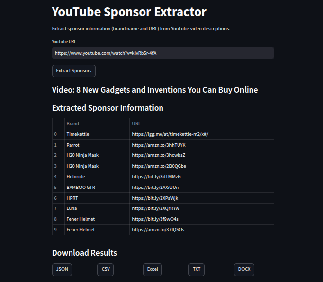

# YouTube Sponsor Extractor

Streamlit app to extract sponsor brand names and URLs from YouTube video descriptions using OpenRouter's language model. Results are shown in a table and downloadable as JSON, CSV, Excel, DOCX, or TXT.



## Features
- Input YouTube URL to fetch description.
- Extracts sponsors via OpenRouter API.
- Displays results in a table.
- Download in multiple formats.

## Prerequisites
- Python 3.8+
- API Keys:
  - [YouTube Data API](https://console.cloud.google.com/)
  - [OpenRouter](https://openrouter.ai/)

## Setup
1. **Virtual Environment**:
   ```bash
   python -m venv env
   source env/bin/activate  # macOS/Linux
   env\Scripts\activate  # Windows
   ```

2. **Install Dependencies**:
   ```bash
   pip install -r requirements.txt
   ```

3. **Configure API Keys**:
   Create `.env`:
   ```
   YOUTUBE_API_KEY=your_youtube_key
   OPENROUTER_API_KEY=your_openrouter_key
   ```

4. **Verify Files**:
   Ensure `sponsor_extraction_prompt.txt` and other files are present (see [Structure](#structure)).

## Running
Run:
```bash
streamlit run main.py
```
Open `http://localhost:8501` in a browser.

## Using
1. Enter YouTube URL (e.g., `https://www.youtube.com/watch?v=dQw4w9WgXcQ`).
2. Click "Extract Sponsors".
3. View brand names and URLs in table.
4. Download as JSON, CSV, Excel, DOCX, or TXT.
